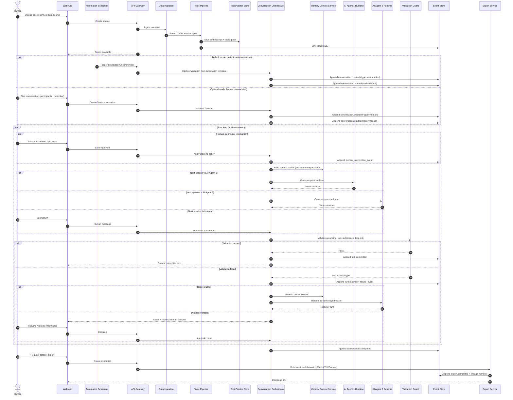

```mermaid
sequenceDiagram
  autonumber
  actor Human
  participant UI as Web App
  participant Auto as Automation Scheduler
  participant API as API Gateway
  participant Ingest as Data Ingestion
  participant Topic as Topic Pipeline
  participant TV as Topic/Vector Store
  participant Orch as Conversation Orchestrator
  participant Mem as Memory Context Service
  participant A1 as AI Agent 1 Runtime
  participant A2 as AI Agent 2 Runtime
  participant Val as Validation Guard
  participant ES as Event Store
  participant Export as Export Service

  Human->>UI: Upload docs / connect data source
  UI->>API: Create source
  API->>Ingest: Ingest raw data
  Ingest->>Topic: Parse, chunk, extract topics
  Topic->>TV: Save embeddings + topic graph
  Topic->>ES: Emit topic.ready
  API-->>UI: Topics available

  alt Default mode: periodic automation start
    Auto->>API: Trigger scheduled run (cron/rrule)
    API->>Orch: Start conversation from automation template
    Orch->>ES: Append conversation.created(trigger=automation)
    Orch->>ES: Append conversation.started(mode=default)
  else Optional mode: human manual start
    Human->>UI: Start conversation (participants + objective)
    UI->>API: Create/Start conversation
    API->>Orch: Initialize session
    Orch->>ES: Append conversation.created(trigger=human)
    Orch->>ES: Append conversation.started(mode=manual)
  end

  loop Turn loop (until terminated)
    opt Human steering or interruption
      Human->>UI: Interrupt / redirect / pin topic
      UI->>API: Steering event
      API->>Orch: Apply steering policy
      Orch->>ES: Append human_intervention_event
    end

    Orch->>Mem: Build context packet (topic + memory + rules)

    alt Next speaker is AI Agent 1
      Orch->>A1: Generate proposed turn
      A1-->>Orch: Turn + citations
    else Next speaker is AI Agent 2
      Orch->>A2: Generate proposed turn
      A2-->>Orch: Turn + citations
    else Next speaker is Human
      Human->>UI: Submit turn
      UI->>API: Human message
      API->>Orch: Proposed human turn
    end

    Orch->>Val: Validate grounding, topic adherence, loop risk
    alt Validation passed
      Val-->>Orch: Pass
      Orch->>ES: Append turn.committed
      Orch-->>UI: Stream committed turn
    else Validation failed
      Val-->>Orch: Fail + failure type
      Orch->>ES: Append turn.rejected + failure_event
      alt Recoverable
        Orch->>Mem: Rebuild stricter context
        Orch->>A2: Reroute to verifier/synthesizer
        A2-->>Orch: Recovery turn
      else Not recoverable
        Orch-->>UI: Pause + request human decision
        Human->>UI: Resume / reroute / terminate
        UI->>API: Decision
        API->>Orch: Apply decision
      end
    end
  end

  Orch->>ES: Append conversation.completed
  Human->>UI: Request dataset export
  UI->>API: Create export job
  API->>Export: Build versioned dataset (JSONL/CSV/Parquet)
  Export->>ES: Append export.completed + lineage manifest
  Export-->>UI: Download link

```