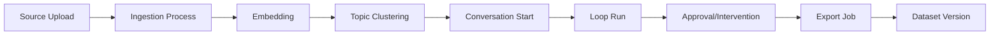

# System Overview

## 한 줄 요약

`gemeinschaft`는 문서 기반 컨텍스트를 활용해 멀티-참여자 대화를 실행하고, 그 결과를 이벤트/데이터셋으로 관리하는 내부 백엔드 플랫폼입니다.

## 핵심 목표

- 대화 상태를 append-only 이벤트로 기록
- 수집된 문서를 임베딩/토픽으로 가공해 대화 근거로 활용
- 수동/자동(스케줄) 방식으로 대화를 시작하고 반복 실행
- 대화 결과를 버전된 데이터셋으로 export

## 아키텍처 구성

- `conversation_orchestrator`: 대화 생명주기의 중심
- `data_ingestion`: 원본 소스 처리(업로드, 청킹, 임베딩, 토픽화)
- `scheduler`: 자동화 템플릿 및 실행 이력
- `agent_runtime`: 에이전트 실행 래퍼
- `export_service`: 대화 데이터셋 생성/버전/다운로드
- `api_gateway`, `topic_pipeline`: 현재 스캐폴드 성격
- `shared`: 인증/DB/App factory 공통 모듈

## 상위 동작 흐름

## 설계 특징

- 이벤트 중심 기록: `event` 테이블에 시퀀스 기반 append
- 읽기 모델 분리: `conversation_snapshot` 등 조회 최적화 테이블 병행
- 다중 테넌트/워크스페이스 스코프: 헤더 기반 scope enforcement
- 내부 API 보호: `INTERNAL_API_TOKEN` 기반 인증 + role/scope 제어
- 운영 편의: keyset cursor 페이지네이션, request id, DB pool 옵션 제공
